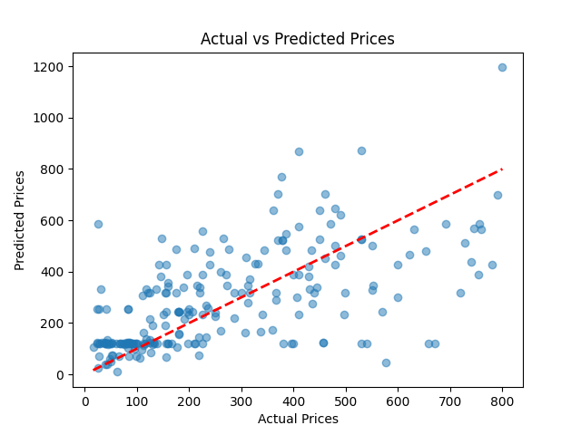
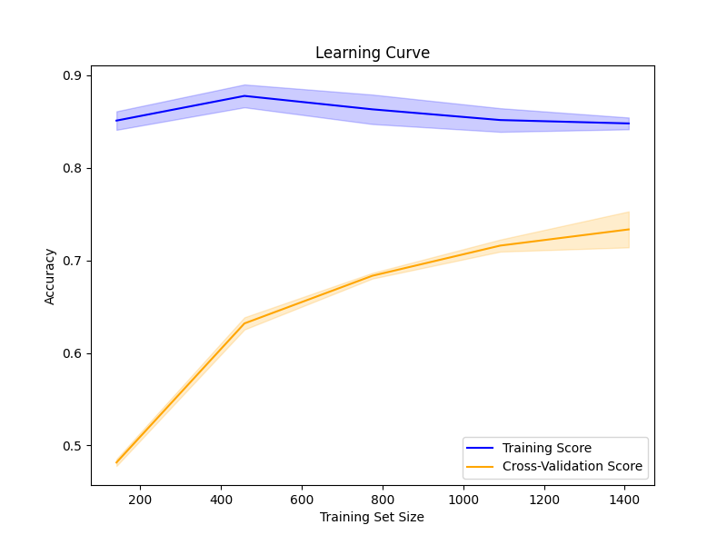
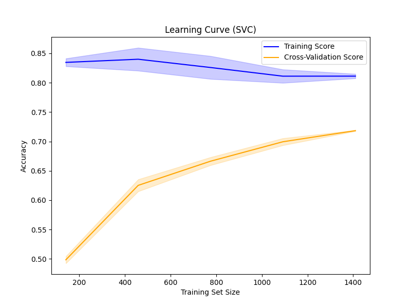
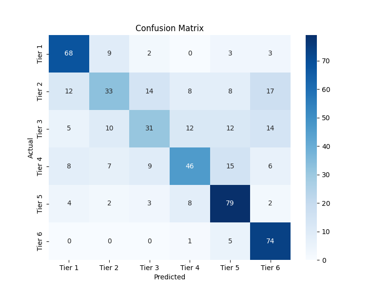
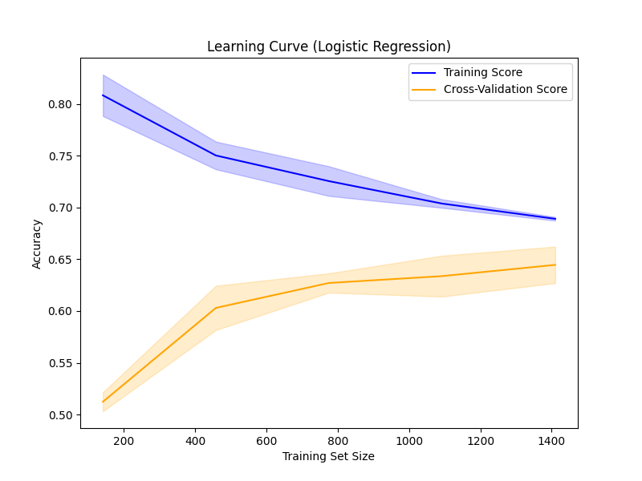

# E-Commerce Product Price Classification

## Project Overview
This project develops and evaluates multiple machine learning models to classify e-commerce products into price tiers based on their technical specifications. By analyzing features such as processor type, RAM size, storage capacity, and other specifications, the models predict which price category a product belongs to.

### Setup and Installation

1. **Clone the Repository**
   ```bash
   git clone https://github.com/MatasMartinkus/E-Commerce-Price-classification-regression.git
   cd EComPriceLinearReg
   ```

2. **Create a Virtual Environment**
   ```bash
   python -m venv venv
   source venv/bin/activate  # On Windows: venv\Scripts\activate
   ```

3. **Install Dependencies**
   ```bash
   pip install -r requirements.txt
   ```
   
   Dependencies include:
   - pandas
   - numpy
   - scikit-learn
   - xgboost
   - matplotlib
   - seaborn

### Using the Models

1. **Run the Full Pipeline**
   ```bash
   python main.py
   ```
   This will:
   - Load and preprocess the data
   - Train all classification models
   - Generate all visualizations
   - Save the models and results

2. **Use Pre-trained Models for Prediction**
   ```python
   import pickle
   import pandas as pd
   
   # Load the model and preprocessing utilities
   with open('random_forest_classifier.pkl', 'rb') as f:
       model = pickle.load(f)
   
   with open('encoder.pkl', 'rb') as f:
       encoder = pickle.load(f)
       
   with open('scaler.pkl', 'rb') as f:
       scaler = pickle.load(f)
   
   # Prepare your new data
   # Example: new_data is a pandas DataFrame with the same structure as the training data
   new_data = pd.read_csv('new_products.csv')
   
   # Preprocess using the same steps as in training
   # (Simplified example - refer to main.py for complete preprocessing)
   new_data_processed = preprocess(new_data)
   
   # Make predictions
   predictions = model.predict(new_data_processed)
   
   # Decode predictions to get price tier labels
   price_tiers = ["Tier 1", "Tier 2", "Tier 3", "Tier 4", "Tier 5", "Tier 6"]
   predicted_tiers = [price_tiers[p] for p in predictions]
   ```

3. **View Visualizations**
   After running the pipeline, check the following directories for generated visualizations:
   - `xgbc/` - XGBoost Classifier results
   - `svc/` - Support Vector Classifier results  
   - `logreg/` - Logistic Regression results
   - Root directory - Model comparison and general visualizations

4. **Customizing the Analysis**
   - Modify bin ranges in `main.py` to adjust price tier definitions
   - Add or remove features by modifying the `categorical_columns` and `numerical_columns` lists
   - Adjust hyperparameter search space by modifying the `param_grid` dictionaries for each model


## Data Description
The dataset (`varle_product_info.csv`) contains information about mobile devices with various technical specifications and their corresponding prices. Key features include:
- Processor specifications (`procesorius_feature`)
- Operating system (`operating_system_feature`)
- Brand (`brand_feature`)
- RAM size (`ram_size_feature`)
- Storage capacity (`storage_feature`)
- Screen resolution (`screen_resolution_feature`)
- Band/connectivity (`band_feature`)
- Price (target variable)

## Preprocessing Steps
1. **Data Cleaning**
   - Removed irrelevant columns
   - Dropped specific features with limited predictive value (`procesorius_core_count_feature`, `procesorius_clock_feature`, `screen_size_feature`)
   - Handled missing values by replacing them with "Unknown" for categorical features
   - Removed outliers by filtering out products priced above €800

2. **Feature Engineering**
   - Processed screen resolution data to extract meaningful numerical values
   - Applied one-hot encoding to categorical variables using `OneHotEncoder`
   - Scaled numerical features using `RobustScaler` or `StandardScaler`

3. **Target Variable Transformation**
   - Converted continuous price values into discrete price tiers/categories
   - Created 6 price tiers: Tier 1 (€0-150), Tier 2 (€150-300), Tier 3 (€300-450), Tier 4 (€450-600), Tier 5 (€600-750), Tier 6 (€750+)

## Model Development
Four different classification models were implemented and compared:

1. **XGBoost Classifier**
   - Hyperparameter tuning using GridSearchCV
   - Parameters tuned: `n_estimators`, `max_depth`, `learning_rate`, `subsample`, `colsample_bytree`, `gamma`, `reg_alpha`, `reg_lambda`

2. **Support Vector Machine (SVM)**
   - Hyperparameter tuning using GridSearchCV
   - Parameters tuned: `C`, `kernel`, `gamma`, `degree`

3. **Logistic Regression**
   - Hyperparameter tuning using GridSearchCV
   - Parameters tuned: `C`, `penalty`, `solver`, `max_iter`

4. **Multi-layer Perceptron (MLP) Classifier**
   - Hyperparameter tuning using GridSearchCV
   - Parameters tuned: `hidden_layer_sizes`, `activation`, `solver`, `alpha`, `learning_rate`, `max_iter`

## Evaluation Metrics
Models were evaluated using the following metrics:
- **Accuracy**: Overall correctness of predictions
- **Precision**: Proportion of positive identifications that were actually correct
- **Recall**: Proportion of actual positives that were identified correctly
- **F1-Score**: Harmonic mean of precision and recall

## Results and Visualizations

### Price Distribution

*Distribution of product prices in the dataset, showing the range and concentration of prices.*

### Regression Analysis

*Linear regression performance showing actual vs. predicted prices.*


*Random Forest regression performance showing improved accuracy in price prediction.*

### Classification Models Performance

#### XGBoost Classifier

*Confusion matrix for XGBoost model, showing prediction accuracy across price tiers.*


*Learning curve showing how the XGBoost model's performance changes with training data size.*

#### Support Vector Machine

*Confusion matrix for SVC model, showing prediction accuracy across price tiers.*


*Learning curve showing how the SVC model's performance changes with training data size.*

#### Logistic Regression

*Confusion matrix for Logistic Regression model, showing prediction accuracy across price tiers.*


*Learning curve showing how the Logistic Regression model's performance changes with training data size.*

### Model Comparison

*Radar chart comparing all models across multiple performance metrics (Accuracy, Precision, Recall, F1-Score).*

## Conclusion

### Key Findings
- The XGBoost classifier generally performed best with highest overall accuracy and F1-score
- All models showed better prediction performance for mid-range price tiers compared to extreme tiers
- Feature importance analysis revealed that brand, processor type, and RAM size were the most influential features for price prediction

### Model Selection
Based on comprehensive evaluation, the XGBoost model provides the best balance of accuracy, robustness, and interpretability for this classification task. It successfully captures the complex relationships between product specifications and price categories.

### Future Work
- Incorporate additional product features and specifications
- Explore more advanced preprocessing techniques for categorical variables
- Implement regression models to predict exact prices rather than categories
- Deploy the model as an API for real-time price tier prediction

## Project Structure
```
EComPriceLinearReg/
├── main.py              # Main script with data processing and modeling code
├── varle_product_info.csv # Dataset (not included in repo)
├── README.md            # Project documentation
├── random_forest_classifier.pkl  # Saved model
├── scaler.pkl           # Saved scaler
├── encoder.pkl          # Saved encoder
└── visualizations/      # Generated visualization images
    ├── Model_Comparison.png
    ├── Price_distribution_scatterplot.png
    ├── xgbc/
    │   ├── Confusion_matrix_XGBC.png
    │   └── learning_curve_XGBC.png
    ├── svc/
    │   ├── Confusion_matrix_SVC.png
    │   └── learning_curve_SVC.png
    └── logreg/
        ├── Confusion_matrix_logreg.png
        └── learning_curve_logreg.png
```